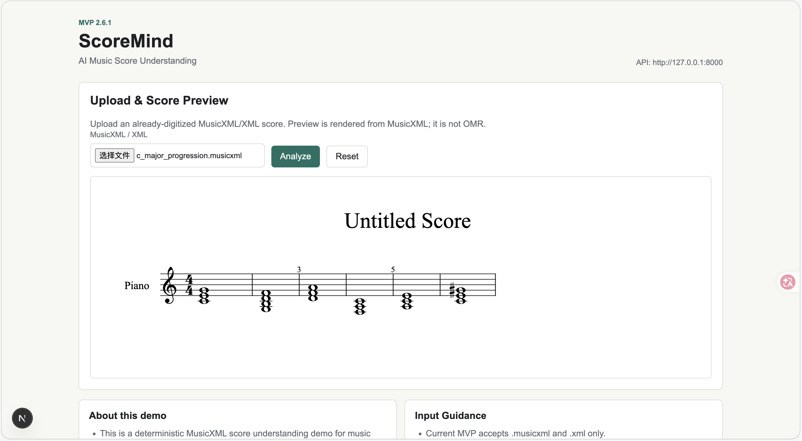
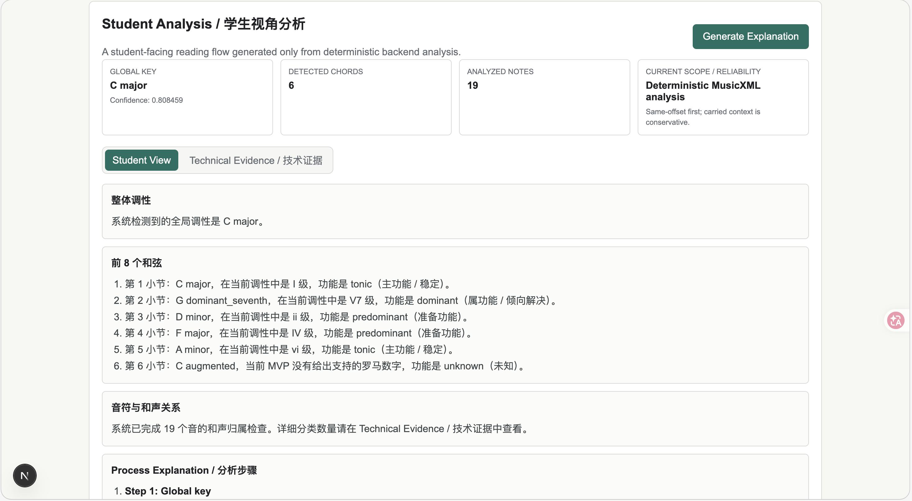
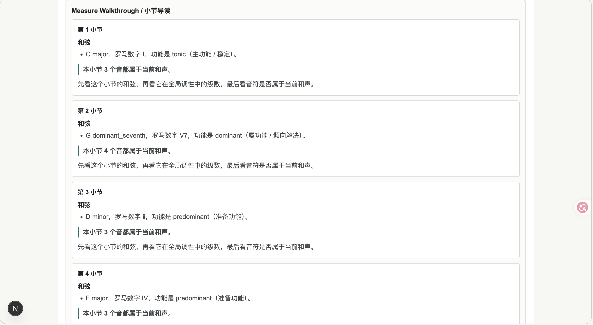
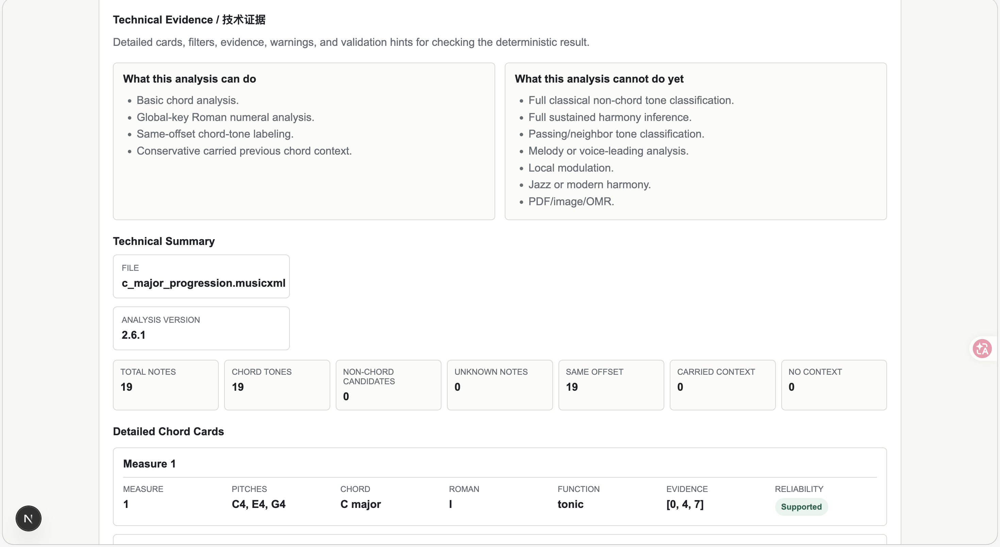

# ScoreMind — AI Music Score Understanding (MVP 3.2)

ScoreMind is a deterministic MusicXML score understanding tool for music students. It parses symbolic score data, analyzes basic harmony and note-level chord membership, renders a score preview, and turns the result into student-friendly learning views.

Current release: MVP 3.2. Current uploads remain limited to `.musicxml` and `.xml`.

MVP 3.2 polishes the Chinese student-facing reading experience. Global key, chord progression, harmonic function, note-level relationship, context reliability, terminology guide, and measure walkthrough explanations are now more natural and concise in Chinese. No new analysis capability was added.

## Why I Built This

Generic AI tools can explain music in natural language, but they are not reliable as the source of truth for score analysis. ScoreMind takes a different approach: music-theory reasoning stays deterministic and auditable, while student-facing explanations are generated only from structured analysis results.

## Product Positioning

ScoreMind is not a chatbot. It is a structured score-understanding prototype built around:

- MusicXML as the input format.
- FastAPI and `music21` for deterministic symbolic analysis.
- Next.js for score preview, student learning views, technical evidence, and report export.
- Clear boundaries between analysis, evidence, and explanation.

## Current MVP Capabilities

- Upload `.musicxml` or `.xml` files.
- Use the Score Input Workspace to understand supported and unsupported score sources.
- Render a MusicXML score preview.
- Detect basic triads and seventh chords.
- Estimate global key and conservative Roman numerals.
- Label basic harmonic functions.
- Classify notes as chord tones, non-chord tone candidates, or unknown based on same-offset or carried within-measure harmony context.
- Show a simplified Student Analysis, Process Explanation, Measure Walkthrough, Technical Evidence, and a Markdown Learning Report.
- Provide downloadable demo MusicXML samples for quick testing.

## What It Does Not Support Yet

- PDF/image/scanned-score upload, OMR, or automatic conversion.
- `.mxl`, audio, MIDI, or notation-project input.
- Real OpenAI/LLM reasoning.
- Local modulation, passing tone, neighbor tone, full sustained harmony, melody/voice-leading, or jazz/modern harmony analysis.
- Database persistence, authentication, user accounts, or marketplace workflows.

## Demo Screenshots

### Upload & Score Preview

Users upload a MusicXML/XML score and preview the rendered score before running deterministic analysis.



### Student Analysis

The student-facing view summarizes global key, detected chords, analyzed notes, reliability scope, and beginner-readable harmonic explanations.



### Measure Walkthrough

Each measure is explained with chord label, Roman numeral, harmonic function, and a concise note-relationship summary.



### Technical Evidence

Advanced users can inspect supported/unsupported scope, detailed chord cards, note-level evidence, and reliability labels.



See `docs/SCREENSHOT_GUIDE.md` for suggested captions and additional screenshot ideas.

## Portfolio Summary

ScoreMind demonstrates an AI product architecture where domain reasoning is deterministic, testable, and evidence-backed. The frontend translates structured backend output into a student-friendly learning flow without claiming unsupported AI capabilities.

## Resume Bullets

- Built a deterministic MusicXML analysis backend with FastAPI, Pydantic, `music21`, and pytest.
- Implemented chord, global key, Roman numeral, harmonic function, and conservative note-level harmony-membership analysis.
- Built a Next.js frontend with MusicXML score preview, Student Analysis, Technical Evidence, and Markdown Learning Report export.
- Created validation, architecture, roadmap, release, demo, screenshot, and input-expansion documentation for portfolio-ready presentation.

## Documentation

- `docs/INPUT_EXPANSION.md`: user-facing import guidance and current MusicXML workflow.
- `docs/INPUT_RESEARCH.md`: developer/product research for future PDF/image/OMR input paths.
- `docs/OMR_EXPERIMENT.md`: isolated OMR feasibility research plan, evaluation criteria, failure cases, and decision gates.
- `docs/DEMO_FLOW.md`: demo script and recommended fixtures.
- `docs/PORTFOLIO.md`: product framing, target user, technical highlights, and resume-ready bullets.
- `docs/ARCHITECTURE.md`: backend/frontend architecture and deterministic analysis boundary.
- `docs/ROADMAP.md`: future work, clearly separated from current capability.
- `docs/VALIDATION.md`: validation process for current fixtures.
- `docs/RELEASE_NOTES.md`: release summary, run instructions, validation status, and limitations.
- `docs/SCREENSHOT_GUIDE.md`: suggested screenshots and captions for GitHub/portfolio presentation.

## Product Flow

- Score Input Workspace: choose a score source, read import guidance, upload `.musicxml` or `.xml`, and render the MusicXML score for visual verification.
- Student Analysis: read Student Summary, Process Explanation, Measure Walkthrough, Terminology Guide, and static learning hints.
- Technical Evidence: inspect detailed chord cards, note-level filters, summaries, backend warnings, and validation hints.
- Export Learning Report: generate a Markdown report from the current deterministic backend analysis, then copy or download it as a `.md` file.

## Input Guidance

- If you have `.musicxml` or `.xml`, upload it directly.
- If you use MuseScore or notation software, export MusicXML/XML first, then upload.
- If you only have PDF, image, screenshot, or scanned paper, convert externally to MusicXML before using this MVP.
- The Score Input Workspace explains these paths in the frontend, but it does not add PDF/image/MIDI/audio upload.
- Input conversion is future work. MVP 3.2 keeps the runtime upload path limited to MusicXML/XML.

## Sample Files

MVP 3.2 includes downloadable demo MusicXML files in `frontend/public/samples`:

- `frontend/public/samples/c_major_progression.musicxml`: demonstrates global key, Roman numerals, harmonic functions, and Measure Walkthrough.
- `frontend/public/samples/carried_context_notes.musicxml`: demonstrates note-level chord-tone labels and carried previous chord context.

In the frontend, use the `Try sample files` panel to download a sample, then upload it manually through the normal MusicXML/XML upload flow. These files are demo assets only; they are not an input conversion feature.

## Scope

- Backend deterministic analysis remains the source of truth.
- Student Analysis is computed only from existing backend analysis JSON and does not infer new conclusions.
- MusicXML/XML remains the only runtime input path in MVP 3.2.
- OMR feasibility work lives only in `docs/OMR_EXPERIMENT.md` and `experiments/omr`.
- Input conversion, real LLM explanation, and advanced music-theory analysis are future work.

## Run Backend

```bash
cd backend
pip install -e ".[dev]"
uvicorn app.main:app --reload
```

Backend default:

```text
http://127.0.0.1:8000
```

## Run Frontend

```bash
cd frontend
npm install
npm run dev
```

Frontend default:

```text
http://localhost:3000
```

Optional frontend environment variable:

```bash
NEXT_PUBLIC_API_BASE_URL=http://127.0.0.1:8000
```

## Recommended Demo

Use:

- `backend/tests/fixtures/c_major_progression.musicxml`
- or download `frontend/public/samples/c_major_progression.musicxml` from the frontend `Try sample files` panel.

Then:

1. Upload the MusicXML file.
2. Preview the rendered score.
3. Click `Analyze`.
4. Read Student Analysis.
5. Open Technical Evidence.
6. Generate Learning Report, then copy or download it as a `.md` file.

See `docs/DEMO_FLOW.md` for a fuller script.

## Validation Dataset

Current fixtures:

- `simple_chords.musicxml`
- `chord_quality_matrix.musicxml`
- `c_major_progression.musicxml`
- `c_major_inversions.musicxml`
- `carried_context_notes.musicxml`

Validation docs:

- `docs/VALIDATION.md`
- `docs/VALIDATION_REPORT_TEMPLATE.md`
- `docs/reviews/mvp-1.4-carried-context-notes-review.md`

## Limitations

MVP 3.2 renders MusicXML only and does not use an LLM. It still does not support PDF/image/OMR, `.mxl`, audio, MIDI, local modulation, passing tone detection, neighbor tone detection, full sustained harmony inference, phrase-level harmony, full non-chord tone analysis, melody/voice-leading analysis, or jazz/modern harmony. OMR work remains isolated research only and does not add runtime input support. Sample files are for demo use only and do not add conversion support. Expert Review is not part of the core UI. Backend analysis behavior is unchanged in MVP 3.2.
