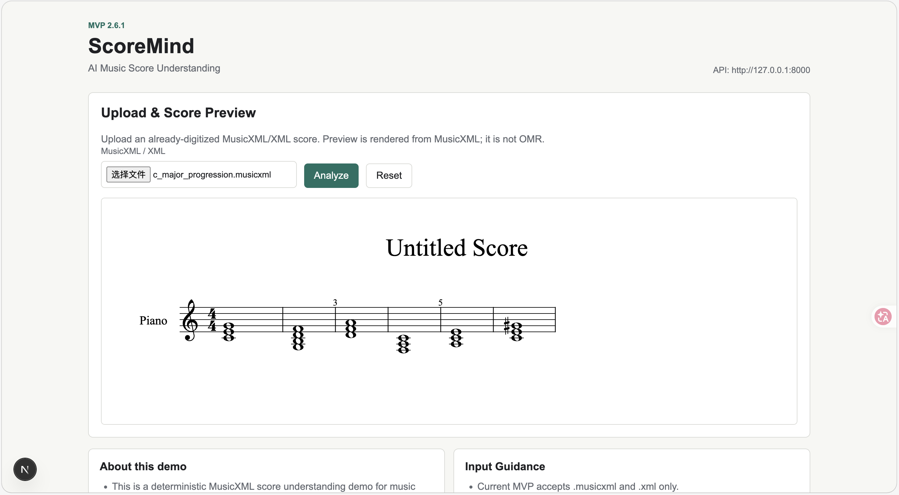
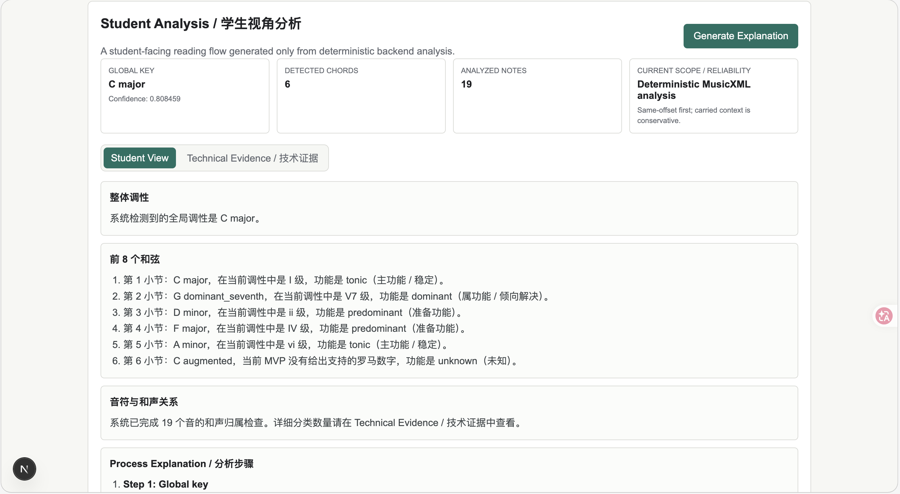
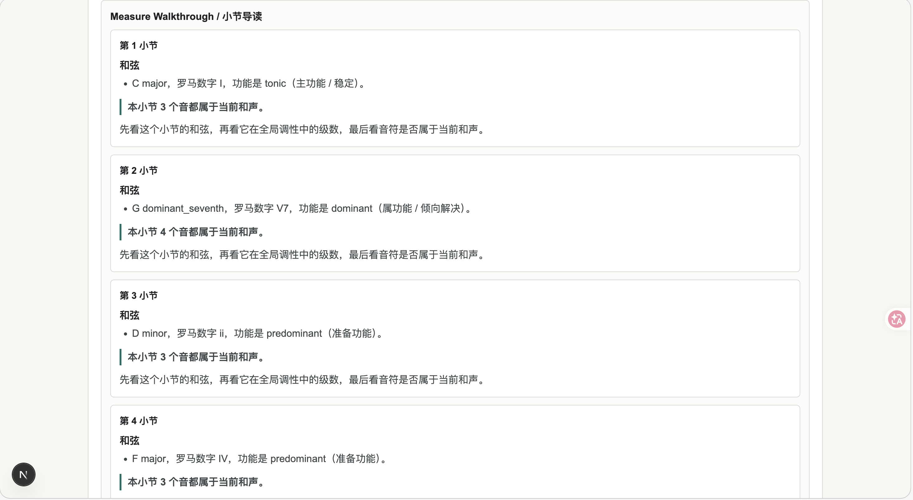
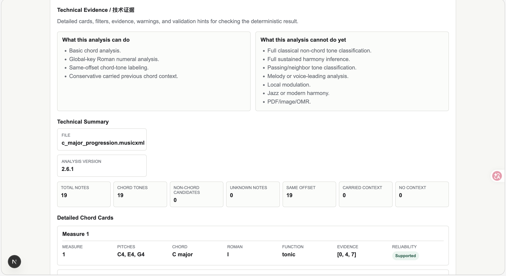

# ScoreMind — AI Music Score Understanding (MVP 3.9)

ScoreMind is a deterministic MusicXML score understanding tool for music students. It parses symbolic score data, analyzes basic harmony and note-level chord membership, renders a score preview, and turns the result into student-friendly learning views.

Current release: MVP 3.9. Current score uploads remain limited to `.musicxml` and `.xml`.

MVP 3.9 adds a separate **professional human review record** beside written-measure navigation. A reviewer can mark a written measure or one of its source note IDs as correct, uncertain, or wrong; record a category, suggested result, and rationale; edit or delete entries; and export/import a strictly validated JSON review package. The package is tied to SHA-256 of the original uploaded file and the analysis version; compact UTF-8 JSON is capped at 1 MiB across save, export, and import. Browser-local drafts are not cloud sync and may be unavailable in private mode or when storage is full. Review data never changes the deterministic API response, confidence labels, explanation request, or Markdown Learning Report.

MVP 3.8 links the rendered score preview and Technical Evidence by **written measure order**. Choose a measure in either area or use Previous/Next; OSMD scrolls to and outlines the corresponding graphical measure on every staff. The mapping checks OSMD source and graphical measure identity before highlighting. If rendering, timeline support, or mapping is unavailable, the UI states why and draws no misleading outline. This is measure-level navigation only, not note-click highlighting or a new harmony conclusion. Existing backend analysis rules, API fields, explanation compatibility, and upload formats are unchanged.

MVP 3.7 adds auditable written-pitch observations to each notated time slice: active notes, new onsets, earlier continuing notes, exact source references, and a lowest written pitch only when comparison is safe. These observations are **not chords** and do not feed the existing harmony or note-role rules. Technical Evidence shows them per measure; old analysis JSON without observations remains valid. Nonstandard sound `<tie type="continue">` is diagnosed instead of accepted; notation `<tied type="continue">` with sound `stop+start` remains supported. A minimal CI runs backend tests and the frontend build.

MVP 3.6 established the independent **notated-duration timeline** with exact time, source-note references, conservative tie joining, and a per-measure Technical Evidence view. Existing harmony, note-role, and low-confidence NCT candidate rules do not consume it.

### MVP 3.6 持续音时间轴

- 按 MusicXML 记谱时值建立 `[start, end)` 时间片，正确显示错开起音、结束边界、休止和安全的跨小节延音线。
- `notated_timeline` 是独立增量字段：原始片段、持续事件、来源引用、时间片、可定位诊断。时间以四分音符为单位，JSON 使用精确分数字符串（例如 `"4/3"`），不是浮点近似。
- 技术证据中的“持续音时间轴”按小节查看，区分书面顺序与显示小节号；不新增学生和声结论，也不改变学习报告结构。
- 一个必要的数据修正：旧解析不再合并重复编号的小节，响应增加可选 `measure_index`。基础和弦识别、调性、罗马数字、音符分类规则保留；旧 JSON 缺少新字段仍可解释。
- 只处理书面顺序，不展开反复，不模拟踏板或演奏时值。移调乐器保留**记谱音高**并给出诊断，不输出混合实音。缺失身份、损坏延音线和不支持结构均有诊断。
- 参见 [架构](docs/ARCHITECTURE.md)、[验证说明](docs/VALIDATION.md)、[发布说明](docs/RELEASE_NOTES.md)。

## Why I Built This

Generic AI tools can explain music in natural language, but they are not reliable as the source of truth for score analysis. ScoreMind takes a different approach: music-theory reasoning stays deterministic and auditable, while student-facing explanations are generated only from structured analysis results.

## Product Positioning

ScoreMind is not a chatbot. It is a structured score-understanding prototype built around:

- MusicXML as the input format.
- FastAPI and `music21` for deterministic symbolic analysis.
- Next.js for score preview, student learning views, technical evidence, and report export.
- Clear boundaries between analysis, evidence, and explanation.

## Current MVP Capabilities

- Upload `.musicxml` or `.xml` files.
- Use the Score Input Workspace to understand supported and unsupported score sources.
- Render a MusicXML score preview.
- Navigate from Technical Evidence to the matching written score measure, with a visible staff-level outline when mapping is verified.
- Record separate, file-bound human review notes by written measure and optional source note ID; export/import them as JSON.
- Inspect written-duration slices and safe tie chains with traceable note sources in Technical Evidence.
- Detect basic triads and seventh chords.
- Estimate global key and conservative Roman numerals.
- Label basic harmonic functions.
- Classify notes as chord tones, non-chord tone candidates, or unknown based on same-offset or carried within-measure harmony context.
- Provide conservative non-chord tone candidate hints (possible passing tone, possible neighbor tone) for student learning only.
- Show a simplified Student Analysis, Process Explanation, Measure Walkthrough, Technical Evidence, and a Markdown Learning Report.
- Provide downloadable demo MusicXML samples for quick testing.

## What It Does Not Support Yet

- PDF/image/scanned-score upload, OMR, or automatic conversion.
- `.mxl`, audio, MIDI, or notation-project input.
- Real OpenAI/LLM reasoning.
- Local modulation, full classical non-chord tone classification, full sustained harmony, melody/voice-leading, or jazz/modern harmony analysis.
- Definitive passing/neighbor tone classification (only conservative candidate hints are provided).
- Database persistence, authentication, user accounts, or marketplace workflows.
- Shared reviews, cross-device sync, and any automatic promotion of human notes into machine conclusions.

## Demo Screenshots

### Upload & Score Preview

Users upload a MusicXML/XML score and preview the rendered score before running deterministic analysis.



### Student Analysis

The student-facing view summarizes global key, detected chords, analyzed notes, reliability scope, and beginner-readable harmonic explanations.



### Measure Walkthrough

Each measure is explained with chord label, Roman numeral, harmonic function, and a concise note-relationship summary.



### Technical Evidence

Advanced users can inspect supported/unsupported scope, detailed chord cards, note-level evidence, and reliability labels.



See `docs/SCREENSHOT_GUIDE.md` for suggested captions and additional screenshot ideas.

## Portfolio Summary

ScoreMind demonstrates an AI product architecture where domain reasoning is deterministic, testable, and evidence-backed. The frontend translates structured backend output into a student-friendly learning flow without claiming unsupported AI capabilities.

## Resume Bullets

- Built a deterministic MusicXML analysis backend with FastAPI, Pydantic, `music21`, and pytest.
- Implemented chord, global key, Roman numeral, harmonic function, and conservative note-level harmony-membership analysis.
- Built a Next.js frontend with MusicXML score preview, Student Analysis, Technical Evidence, and Markdown Learning Report export.
- Created validation, architecture, roadmap, release, demo, screenshot, and input-expansion documentation for portfolio-ready presentation.

## Documentation

- `docs/INPUT_EXPANSION.md`: user-facing import guidance and current MusicXML workflow.
- `docs/INPUT_RESEARCH.md`: developer/product research for future PDF/image/OMR input paths.
- `docs/OMR_EXPERIMENT.md`: isolated OMR feasibility research plan, evaluation criteria, failure cases, and decision gates.
- `docs/DEMO_FLOW.md`: demo script and recommended fixtures.
- `docs/PORTFOLIO.md`: product framing, target user, technical highlights, and resume-ready bullets.
- `docs/ARCHITECTURE.md`: backend/frontend architecture and deterministic analysis boundary.
- `docs/ROADMAP.md`: future work, clearly separated from current capability.
- `docs/VALIDATION.md`: validation process for current fixtures.
- `docs/RELEASE_NOTES.md`: release summary, run instructions, validation status, and limitations.
- `docs/SCREENSHOT_GUIDE.md`: suggested screenshots and captions for GitHub/portfolio presentation.

## Product Flow

- Score Input Workspace: choose a score source, read import guidance, upload `.musicxml` or `.xml`, and render the MusicXML score for visual verification.
- Student Analysis: read Student Summary, Process Explanation, Measure Walkthrough, Terminology Guide, and static learning hints.
- Technical Evidence: inspect detailed chord cards, note-level filters, summaries, backend warnings, and validation hints.
- Export Learning Report: generate a Markdown report from the current deterministic backend analysis, then copy or download it as a `.md` file.

## Input Guidance

- If you have `.musicxml` or `.xml`, upload it directly.
- If you use MuseScore or notation software, export MusicXML/XML first, then upload.
- If you only have PDF, image, screenshot, or scanned paper, convert externally to MusicXML before using this MVP.
- The Score Input Workspace explains these paths in the frontend, but it does not add PDF/image/MIDI/audio upload.
- Input conversion is future work. MVP 3.9 keeps the runtime score upload path limited to MusicXML/XML.

## Sample Files

MVP 3.9 includes downloadable demo MusicXML files in `frontend/public/samples`:

- `frontend/public/samples/c_major_progression.musicxml`: demonstrates global key, Roman numerals, harmonic functions, and Measure Walkthrough.
- `frontend/public/samples/carried_context_notes.musicxml`: demonstrates note-level chord-tone labels and carried previous chord context.

In the frontend, use the `Try sample files` panel to download a sample, then upload it manually through the normal MusicXML/XML upload flow. These files are demo assets only; they are not an input conversion feature.

## Scope

- Backend deterministic analysis remains the source of truth.
- Student Analysis is computed only from existing backend analysis JSON and does not infer new conclusions.
- MusicXML/XML remains the only runtime score input path in MVP 3.9; review JSON import is a separate human annotation workflow.
- OMR feasibility work lives only in `docs/OMR_EXPERIMENT.md` and `experiments/omr`.
- Input conversion, real LLM explanation, and advanced music-theory analysis are future work.

## Run Backend

```bash
cd backend
pip install -e ".[dev]"
uvicorn app.main:app --reload
```

Backend default:

```text
http://127.0.0.1:8000
```

## Run Frontend

```bash
cd frontend
npm install
npm run dev
```

Frontend default:

```text
http://localhost:3000
```

Optional frontend environment variable:

```bash
NEXT_PUBLIC_API_BASE_URL=http://127.0.0.1:8000
```

## Recommended Demo

Use:

- `backend/tests/fixtures/c_major_progression.musicxml`
- or download `frontend/public/samples/c_major_progression.musicxml` from the frontend `Try sample files` panel.

Then:

1. Upload the MusicXML file.
2. Preview the rendered score.
3. Click `Analyze`.
4. Read Student Analysis.
5. Open Technical Evidence.
6. Generate Learning Report, then copy or download it as a `.md` file.

For an optional human review, use the shared written-measure navigator, then add a review record beside the score. Export the separate JSON before changing browsers; import requires the exact same uploaded file bytes and analysis version. Review entries are never included in the Learning Report.

See `docs/DEMO_FLOW.md` for a fuller script.

## Validation Dataset

Current fixtures:

- `simple_chords.musicxml`
- `chord_quality_matrix.musicxml`
- `c_major_progression.musicxml`
- `c_major_inversions.musicxml`
- `carried_context_notes.musicxml`

Validation docs:

- `docs/VALIDATION.md`
- `docs/VALIDATION_REPORT_TEMPLATE.md`
- `docs/reviews/mvp-1.4-carried-context-notes-review.md`

## Limitations

MVP 3.9 renders MusicXML only and does not use an LLM. Score linkage is limited to verified written measures; a source ID in a review identifies backend data, not a clickable note on the score. It still does not support PDF/image/OMR, `.mxl`, audio, MIDI, local modulation, full classical non-chord tone classification, full sustained harmony inference, phrase-level harmony, melody/voice-leading analysis, or jazz/modern harmony. Non-chord tone candidate hints remain conservative. Review records are local human annotations, not machine corrections or a marketplace; they require the same file bytes and analysis version for import. OMR remains isolated research.
